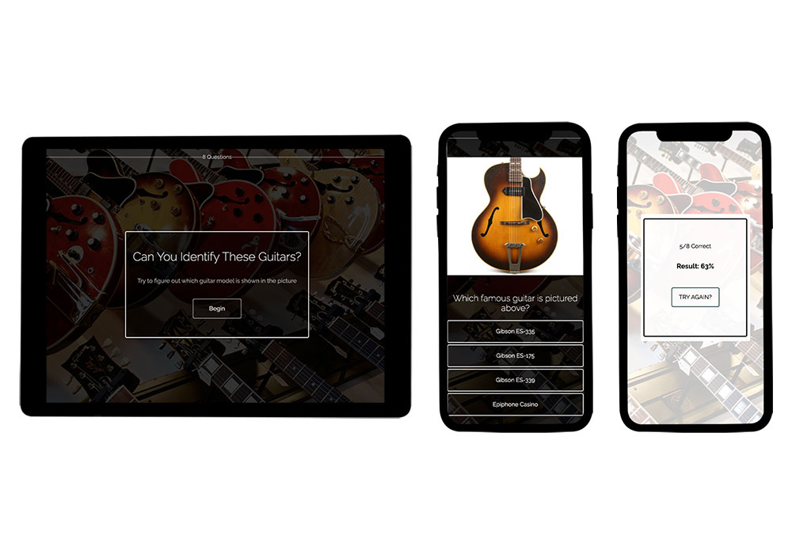

<!-- # Can you name these famous guitar models?

We all know what Stratocasters and Les Pauls look like, but how about some of the other popular guitar types out there?  [Take this quiz to find out!](https://guitar-quiz.netlify.com/) -->

# GuitarQuiz

We all know what Stratocasters and Les Pauls look like, but how about some of the other popular guitar types out there?

## Table of contents

-   [Overview](#overview)
    -   [The challenge](#the-challenge)
    -   [Screenshot](#screenshot)
    -   [Links](#links)
-   [My process](#my-process)
    -   [Built with](#built-with)
    -   [What I learned](#what-i-learned)
    -   [Continued development](#continued-development)
    <!-- - [Useful resources](#useful-resources) -->
-   [Author](#author)
<!-- - [Acknowledgments](#acknowledgments) -->

## Overview

### The challenge

Users should be able to:

-   Progress through the quiz, one question at a time, until the end
-   See a confirmation screen, telling them whether their answer was correct or incorrect
-   View how far along in the quiz they are
-   See their quiz results at the end, and be given the option to try again

### Screenshots

### Links

-   Live Site URL: [https://guitar-quiz.netlify.app/](https://guitar-quiz.netlify.app/)

## My process

### Built with

-   Mobile-first workflow
-   Semantic HTML5 markup
-   CSS Flex and Grid
-   [React](https://reactjs.org/) - JS library
-   [react-spring](https://www.react-spring.io/) - Animation library

<!-- ### What I learned -->

### Continued development

Ways to improve this app include

-   Moving quiz data and images off of the app frontend
-   Adding social media integration for sharing results
-   Adding a login page where users can create and share their own quizzes

<!-- ### Useful resources

- [Example resource 1](https://www.example.com) - This helped me for XYZ reason. I really liked this pattern and will use it going forward.
- [Example resource 2](https://www.example.com) - This is an amazing article which helped me finally understand XYZ. I'd recommend it to anyone still learning this concept.

**Note: Delete this note and replace the list above with resources that helped you during the challenge. These could come in handy for anyone viewing your solution or for yourself when you look back on this project in the future.** -->

## Author

-   [Michael Weber](https://michaelweber.dev/)
-   [LinkedIn](https://www.linkedin.com/in/michaelscottweber/)

<!-- ## Acknowledgments

This is where you can give a hat tip to anyone who helped you out on this project. Perhaps you worked in a team or got some inspiration from someone else's solution. This is the perfect place to give them some credit.

**Note: Delete this note and edit this section's content as necessary. If you completed this challenge by yourself, feel free to delete this section entirely.** -->
